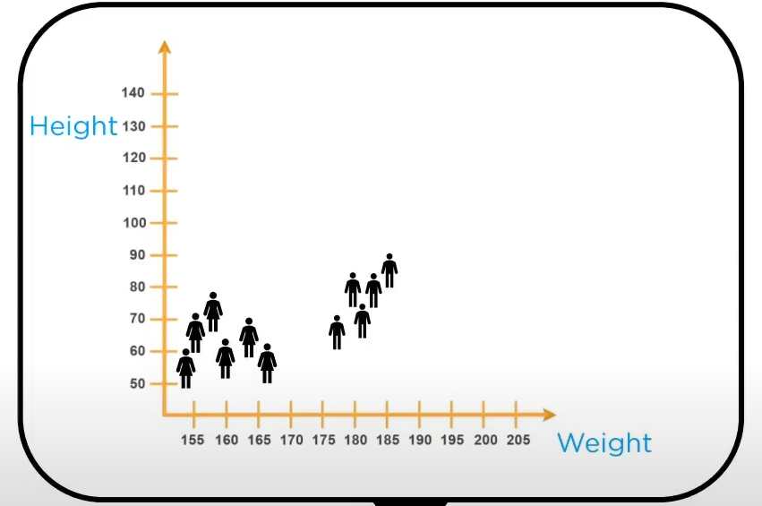
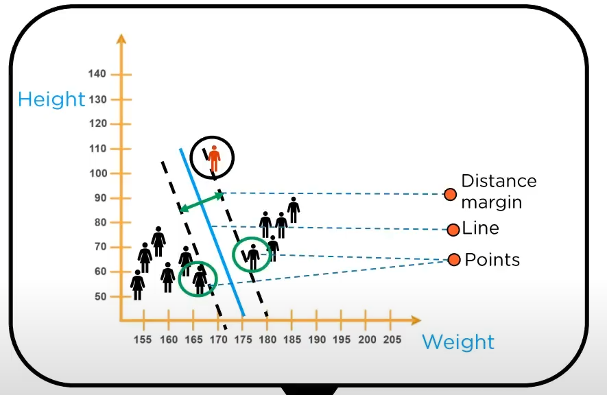
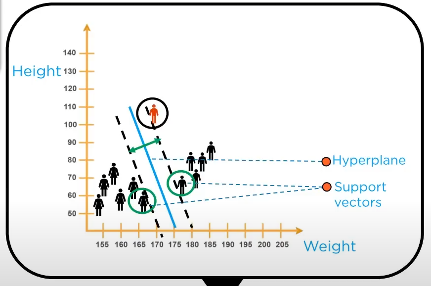
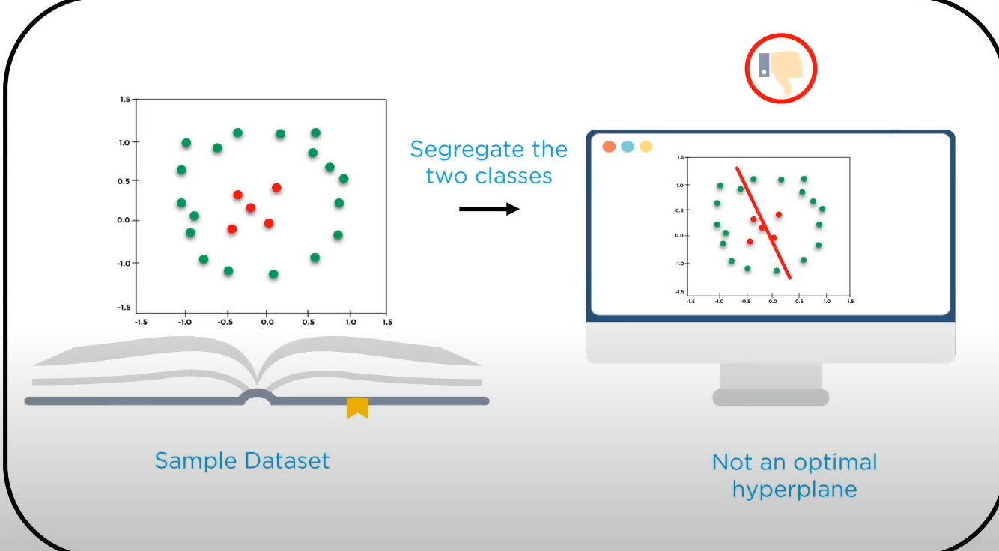
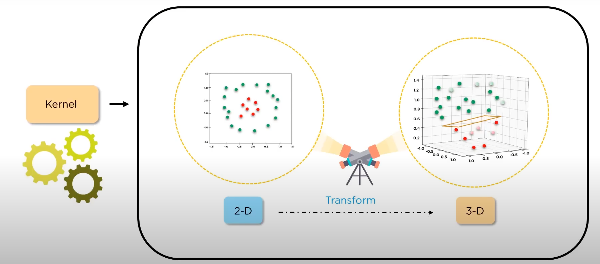
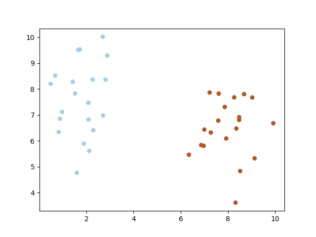

# Statistics and Machine Learning for Experimental Physiscs

## Machine Learning
- Machine learning is the science of making computers learn and act like humans by feeding data and information without being explicitly programmed.

```text
             Train          Prediction
[Past Data] <----> [System] ----------> [Output]
            Analysis
Data is             System              Machine Learning makes
Processed           Learns              predictions and decisions
                                        based on Past Data
```

- This is of two types.


### Supervised
- The process of learning with training labels. 
- It has a feedback mechanism.
- Most commonly used
    - 1) Decision Tree
    - 2) Logistic Regression
    - 3) Support Vector Machine

- Used in 
    - 1) Risk Assesment 
    - 2) Image Classification
    - 3) Fraud Detection
    - 4) Visual Recognition

- 1) Classification
    - When the output variable is catagorical; i.e. with two or more classes (yex/no, true/false), we make use of classification.
    - e.g. spam filters
- 2) Regression
    - Relationship of two or more variables where a change in one variable is associated with a change in another variable.
    - e.g. having a prediction of humidity with temperature based of past data 
### Unsupervised
- The process of learning without training labels. 
- Has no feedback mechanism.
- Most commoly used
    - 1) k Means Clustering
    - 2) Hierarchical Clustering 
    - 3) Apriori Algorithm

- Used in 
    - 1) Market Basket Analysis
    - 2) Semantic Clustering 
    - 3) Delivery Store Optimization

- 1) Clustering
    - A method of dividing objects into data clusters which are similar between them and are dissimilar between the objects belonging to another cluster.
- 2) Association
    - Discovering the probability of the co-occurance of items in a collection.
- 3) Dimentional Reduction
---

## Support Vector Machine
- Basic Usage
    - 1) Face Detection
    - 2) Text and Hypertext Catagorization
    - 3) Classification of Images
    - 4) Bioinformatics

- SVM is a supervised learning method that looks at data and sorts it into one of the two catagories.
- We are given a data set. Let be Male and Female (based on height and weight)
- Now to take a new data and catagorize it into one of the two classification we need to fisrt split our data. 
- Now imagine the data as a plot of the weight and height where the males have a group and the females have a group.



- To split this we should use a line that separates the data in the best possible way.
- To do that fist device some basic terminology.



- In technical term the distance between the **support vector** and the **hyperplane** should be as far as possible.
    - **Support vectors** are the extreme points of the datasets.

- In mathematical terms we take `D+` the shortest distance to the closest positive point and `D-` the shortest distance to the closest negative point. The sum of D+ and D- is called the **distance margin**.
- Then from the largest **distance margin** we get the **optimal hyperplane**.
- If we select a hyperplane having low margin then there is high chance of missclassification.

- What we discussed so far is also called **LSVM**.

- But What if the some data points are in between another datapoints.
    - Then we cannot use a hyperplane. 
    - Then we use transformation ([input](1d or 2d) ---> [Kernel] ---> [output](2d or 3d)) to convert the data from say 1d to 2d or 2d to 3d to introdyce a hyperplane.
    
    

### Advantages of Support Vector Machine
- 1) High Dimensional Input Space
- 2) Sparce Document Vectors
- 3) Regularization Parameters

### Use Case - Implementation
```python
import numpy as np
import matplotlib.pyplot as plt
from sklearn import svm
from sklearn.dataset.samples_generator import make_blobs

# we create 40 separable points
X, y = make_blobs(n_samples=40, centers=2, random_state=20)

# fit the model, don't regularize for illustration purposes
clf = svm.SVC(kernel='linear', C=1000)
clf.fit(X,y)
plt.scatter(X[:,0], X[:,1], c=y, s=30, cmap=plt.cm.Paired)
plt.show()
```
- This code snippet creates the following figure

